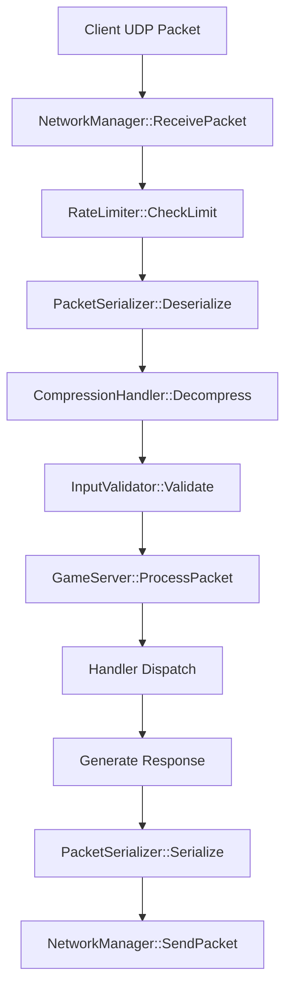
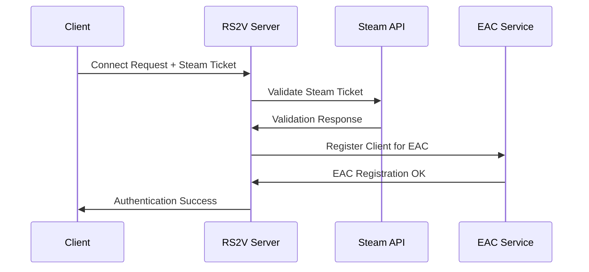

# ARCHITECTURE.md — System Design & Architecture

This document provides a **comprehensive overview** of the RS2V Custom Server architecture, including **system design**, **component interactions**, **data flow patterns**, and **architectural decision rationale**.  
For API details, see **API.md**. For deployment architecture, see **DEPLOYMENT.md**.

## 1 · Architectural Overview

### 1.1 Design Philosophy

The RS2V server follows **modular architecture** principles with clear separation of concerns:

| Principle | Implementation | Benefit |
|-----------|----------------|---------|
| **Modularity** | Independent subsystems with defined interfaces | Maintainability, testability |
| **Performance** | Multi-threaded, zero-copy where possible | Low latency, high throughput |
| **Extensibility** | Plugin system, script hooks | Customization without core changes |
| **Observability** | Comprehensive telemetry and logging | Production monitoring and debugging |
| **Security** | Defense-in-depth, input validation | Robust against attacks and exploits |

### 1.2 High-Level Architecture

```
┌─────────────────────────────────────────────────────────────────┐
│                          RS2V Server                           │
├─────────────────┬─────────────────┬─────────────────────────────┤
│   Game Logic    │    Security     │        Telemetry           │
│                 │                 │                            │
│ • GameServer    │ • EAC Proxy     │ • TelemetryManager         │
│ • PlayerManager │ • AuthManager   │ • MetricsReporter[]        │
│ • TeamManager   │ • BanManager    │ • PrometheusReporter       │
│ • RoundManager  │ • InputValidator│ • FileReporter             │
│ • MapManager    │ • MovementValid │ • AlertReporter            │
├─────────────────┼─────────────────┼─────────────────────────────┤
│   Networking    │     Physics     │        Utilities           │
│                 │                 │                            │
│ • NetworkMgr    │ • PhysicsEngine │ • ThreadPool               │
│ • PacketSerial  │ • CollisionDet  │ • MemoryPool               │
│ • Replication   │ • VehicleMgr    │ • ConfigManager            │
│ • Compression   │ • ProjectileMgr │ • Logger                   │
│ • UE3Protocol   │ • RigidBody     │ • CryptoUtils              │
└─────────────────┴─────────────────┴─────────────────────────────┘
┌─────────────────────────────────────────────────────────────────┐
│                      Scripting Layer                           │
│                                                                 │
│ • ScriptHost (C#/.NET)    • HandlerLibraryManager (Native)     │
│ • Roslyn Compiler        • Dynamic Plugin Loading              │
│ • Sandbox Security       • Hot Reload Support                  │
└─────────────────────────────────────────────────────────────────┘
```

## 2 · Core Subsystems

### 2.1 Network Layer

#### 2.1.1 Component Hierarchy

```
NetworkManager (Singleton)
├── UDPSocket (Platform abstraction)
├── PacketSerializer (Protocol handling)
├── CompressionHandler (zlib/Brotli)
├── RateLimiter (DDoS protection)
└── ClientConnectionManager
    ├── ClientConnection[1..N]
    ├── HeartbeatManager
    └── TimeoutDetector
```

#### 2.1.2 Packet Flow



#### 2.1.3 Threading Model

| Thread | Responsibility | Frequency |
|--------|----------------|-----------|
| **Network I/O** | UDP recv/send, socket management | ~2kHz event-driven |
| **Main/Game** | Game logic, physics, packet processing | 60Hz fixed |
| **Telemetry** | Metrics collection and reporting | 1Hz configurable |
| **Script Worker** | C# script execution (pooled) | On-demand |

### 2.2 Game Logic Layer

#### 2.2.1 Game State Management

```cpp
class GameServer {
private:
    std::unique_ptr m_playerMgr;
    std::unique_ptr m_teamMgr;
    std::unique_ptr m_roundMgr;
    std::unique_ptr m_mapMgr;
    std::unique_ptr m_physics;
    
    GameState m_state;
    uint64_t m_currentTick;
    std::chrono::steady_clock::time_point m_lastTickTime;
};
```

#### 2.2.2 Entity-Component System (Lightweight)

```
Entity (uint32_t ID)
├── Transform Component (Position, Rotation, Scale)
├── Physics Component (RigidBody, Collision)
├── Network Component (Replication flags)
├── Health Component (HP, Max HP, Regen)
└── [Custom Components via Scripts]
```

#### 2.2.3 Game Loop

```cpp
void GameServer::TickLoop() {
    auto now = std::chrono::steady_clock::now();
    auto dt = std::chrono::duration(now - m_lastTickTime).count();
    
    // 1. Process network input
    m_networkMgr->ProcessIncomingPackets();
    
    // 2. Update game logic
    m_playerMgr->Update(dt);
    m_teamMgr->Update(dt);
    m_roundMgr->Update(dt);
    
    // 3. Step physics simulation
    m_physics->Update(dt);
    
    // 4. Execute scripts
    m_scriptHost->BroadcastEvent("OnTick", {{"dt", dt}});
    
    // 5. Generate replication snapshot
    auto snapshot = m_replicationMgr->CreateSnapshot();
    
    // 6. Send network updates
    m_networkMgr->BroadcastSnapshot(snapshot);
    
    // 7. Update telemetry
    TELEMETRY_UPDATE_TICK(++m_currentTick);
    
    m_lastTickTime = now;
}
```

### 2.3 Physics Engine

#### 2.3.1 Architecture

```
PhysicsEngine
├── BroadPhase (Sweep and Prune)
│   └── AABB[] (Spatial partitioning)
├── NarrowPhase (SAT collision detection)
│   └── ContactManifold[] (Collision pairs)
├── Dynamics (Integration)
│   └── RigidBody[] (Entities)
└── Constraints (Joints, limits)
    ├── VehicleConstraint[]
    └── ProjectileConstraint[]
```

#### 2.3.2 Integration Pipeline


### 2.4 Replication System

#### 2.4.1 Actor Replication

```cpp
struct ReplicatedActor {
    uint32_t actorId;
    ActorType type;
    uint32_t ownerId;           // Client that controls this actor
    ReplicationFlags flags;     // What to replicate
    
    std::unordered_map properties;
    std::vector queuedRPCs;
    
    std::chrono::steady_clock::time_point lastUpdate;
    uint32_t priority;          // Replication priority
};
```

#### 2.4.2 Delta Compression

| Strategy | Use Case | Compression Ratio |
|----------|----------|-------------------|
| **Property Delta** | Changed properties only | 60-80% |
| **Quantization** | Position, rotation vectors | 40-60% |
| **Prediction** | Extrapolated movement | 70-90% |
| **Run-Length Encoding** | Repeated values | 30-50% |

### 2.5 Security Architecture

#### 2.5.1 Security Layers

```
┌─────────────────────────────────────────┐
│           Application Layer             │
│  • Input Validation  • Access Control  │
├─────────────────────────────────────────┤
│          Anti-Cheat Layer               │
│  • EAC Integration  • Behavior Analysis │
├─────────────────────────────────────────┤
│          Protocol Layer                 │
│  • Packet Validation  • Rate Limiting  │
├─────────────────────────────────────────┤
│          Transport Layer                │
│  • HMAC Integrity  • Optional Encrypt  │
├─────────────────────────────────────────┤
│          Network Layer                  │
│  • Firewall Rules  • DDoS Protection   │
└─────────────────────────────────────────┘
```

#### 2.5.2 Authentication Flow



## 3 · Data Flow and Communication

### 3.1 Inter-Component Communication

#### 3.1.1 Event System

```cpp
template
class EventBus {
public:
    using Handler = std::function;
    
    void Subscribe(Handler handler);
    void Publish(const EventType& event);
    
private:
    std::vector m_handlers;
    std::mutex m_mutex;
};

// Global event types
namespace Events {
    struct PlayerConnected { uint32_t playerId; std::string steamId; };
    struct PlayerDisconnected { uint32_t playerId; std::string reason; };
    struct RoundStarted { std::string mapName; GameMode mode; };
    struct SecurityViolation { uint32_t playerId; ViolationType type; };
}
```

#### 3.1.2 Message Passing Patterns

| Pattern | Use Case | Implementation |
|---------|----------|----------------|
| **Observer** | Event notifications | EventBus template |
| **Command** | Network packet handling | HandlerRegistry |
| **Publish-Subscribe** | Telemetry reporting | MetricsReporter interface |
| **Producer-Consumer** | Script execution | ThreadPool work queue |

### 3.2 Memory Management

#### 3.2.1 Memory Pools

```cpp
template
class MemoryPool {
public:
    void* Allocate();
    void Deallocate(void* ptr);
    
private:
    static constexpr size_t POOL_SIZE = 1024 * 1024; // 1MB pools
    std::vector> m_pools;
    std::stack m_freeBlocks;
    std::mutex m_mutex;
};

// Specialized pools for common sizes
extern MemoryPool g_smallBlockPool;     // Packets, small objects
extern MemoryPool g_mediumBlockPool;   // Player data, medium objects
extern MemoryPool g_largeBlockPool;   // Maps, large objects
```

#### 3.2.2 Object Lifetime Management

| Object Type | Lifetime | Management Strategy |
|-------------|----------|-------------------|
| **Static Config** | Process lifetime | Global singletons |
| **Game Entities** | Round/match | Smart pointers, RAII |
| **Network Packets** | Single frame | Memory pools |
| **Telemetry Data** | Configurable | Circular buffers |
| **Script Objects** | Script execution | Managed by .NET GC |

### 3.3 Configuration Management

#### 3.3.1 Configuration Hierarchy

```
Configuration Sources (Priority: High → Low)
├── Command Line Arguments        (--port 8777)
├── Environment Variables         ($RS2V_PORT)
├── Config Files                  (server.ini)
├── Default Values               (Hardcoded)
└── Auto-Detected Values        (Hardware detection)
```

#### 3.3.2 Hot Reload Mechanism

```cpp
class ConfigWatcher {
public:
    void WatchFile(const std::string& path, 
                   std::function callback);
private:
    std::thread m_watcherThread;
    
#ifdef _WIN32
    HANDLE m_directoryHandle;
#else
    int m_inotifyFd;
#endif
};
```

## 4 · Threading and Concurrency

### 4.1 Thread Architecture

```
┌─────────────────┐  ┌─────────────────┐  ┌─────────────────┐
│   Main Thread   │  │ Network Thread  │  │Telemetry Thread │
│                 │  │                 │  │                 │
│ • Game Logic    │  │ • Socket I/O    │  │ • Metrics       │
│ • Physics       │  │ • Packet Queue  │  │ • Reporting     │
│ • Script Hooks  │  │ • Rate Limiting │  │ • File I/O      │
│ • Rendering     │  │ • Compression   │  │ • HTTP Server   │
└─────────────────┘  └─────────────────┘  └─────────────────┘
         │                      │                      │
         └──────────────────────┼──────────────────────┘
                                │
                    ┌─────────────────┐
                    │  Thread Pool    │
                    │                 │
                    │ • Script Exec   │
                    │ • File I/O      │
                    │ • Background    │
                    │   Tasks         │
                    └─────────────────┘
```

### 4.2 Synchronization Primitives

| Primitive | Use Case | Performance |
|-----------|----------|-------------|
| **std::shared_mutex** | Config, player lists | Reader-optimized |
| **std::mutex** | Critical sections | Standard protection |
| **std::atomic** | Counters, flags | Lock-free operations |
| **thread_local** | Per-thread caches | Zero contention |

### 4.3 Lock Hierarchy

To prevent deadlocks, locks must be acquired in this order:

```
1. ConfigManager::m_configMutex
2. PlayerManager::m_playerMutex
3. NetworkManager::m_clientMutex
4. TelemetryManager::m_snapshotMutex
5. Logger::m_logMutex
```

## 5 · Scalability Considerations

### 5.1 Performance Bottlenecks

| Bottleneck | Mitigation Strategy | Implementation |
|------------|-------------------|----------------|
| **Network I/O** | Async UDP, packet batching | `epoll`/`IOCP` |
| **Physics** | Spatial partitioning, multithreading | Broad-phase optimization |
| **Script Execution** | Thread pooling, timeouts | .NET ThreadPool |
| **Memory Allocation** | Object pooling, stack allocation | Custom allocators |
| **Log I/O** | Async logging, ring buffers | Background thread |

### 5.2 Horizontal Scaling Design

```
┌─────────────────┐  ┌─────────────────┐  ┌─────────────────┐
│   Game Server   │  │   Game Server   │  │   Game Server   │
│     Instance    │  │     Instance    │  │     Instance    │
│       #1        │  │       #2        │  │       #3        │
└─────────────────┘  └─────────────────┘  └─────────────────┘
         │                      │                      │
         └──────────────────────┼──────────────────────┘
                                │
                    ┌─────────────────┐
                    │  Load Balancer  │
                    │                 │
                    │ • Health Check  │
                    │ • Player Rout   │
                    │ • Session Aff   │
                    └─────────────────┘
                                │
                    ┌─────────────────┐
                    │ Shared Services │
                    │                 │
                    │ • Auth Service  │
                    │ • Ban Database  │
                    │ • Telemetry     │
                    │ • Config Store  │
                    └─────────────────┘
```

### 5.3 Resource Optimization

#### 5.3.1 Memory Optimization

```cpp
// Efficient player data structure
struct Player {
    uint32_t id;                    // 4 bytes
    Vector3 position;               // 12 bytes
    Quaternion rotation;            // 16 bytes  
    uint16_t health;                // 2 bytes
    uint16_t team : 1;              // Bitfield
    uint16_t alive : 1;
    uint16_t admin : 1;
    uint16_t reserved : 13;
    // Total: 36 bytes (cache-friendly)
};
```

#### 5.3.2 Network Optimization

| Technique | Savings | Implementation |
|-----------|---------|----------------|
| **Delta Compression** | 60-80% | Track property changes |
| **Quantization** | 40-60% | Reduce float precision |
| **Bit Packing** | 30-50% | Pack boolean flags |
| **Huffman Coding** | 20-40% | Compress common strings |

## 6 · Security Architecture

### 6.1 Threat Model Implementation

```cpp
namespace Security {

class ThreatMitigator {
public:
    // Network-level threats
    bool MitigateDDoS(const PacketInfo& packet);
    bool MitigateFlood(const ClientInfo& client);
    
    // Application-level threats  
    bool MitigateInjection(const std::string& input);
    bool MitigatePrivilegeEscalation(const Command& cmd);
    
    // Game-specific threats
    bool MitigateSpeedHack(const MovementData& movement);
    bool MitigateAimBot(const InputData& input);
    
private:
    RateLimiter m_packetLimiter;
    InputValidator m_inputValidator;
    MovementValidator m_movementValidator;
    BehaviorAnalyzer m_behaviorAnalyzer;
};

}
```

### 6.2 Cryptographic Architecture

```cpp
namespace Crypto {

class CryptoManager {
public:
    // Session key management
    SessionKey GenerateSessionKey();
    bool ValidateSessionKey(const SessionKey& key);
    
    // Packet integrity
    std::string ComputeHMAC(const PacketData& data, const SessionKey& key);
    bool VerifyHMAC(const PacketData& data, const std::string& hmac, const SessionKey& key);
    
    // Optional encryption
    EncryptedData Encrypt(const PacketData& data, const SessionKey& key);
    PacketData Decrypt(const EncryptedData& encrypted, const SessionKey& key);
    
private:
    std::unique_ptr m_cipherCtx;
    std::unique_ptr m_hmacCtx;
};

}
```

## 7 · Monitoring and Observability

### 7.1 Telemetry Architecture

```
Metrics Collection
├── System Metrics (CPU, Memory, Network)
├── Application Metrics (Players, Packets, Performance)
├── Business Metrics (Kills, Deaths, Score)
└── Security Metrics (Violations, Bans, Alerts)
                    │
                    ▼
            TelemetryManager
                    │
         ┌──────────┼──────────┐
         ▼          ▼          ▼
   FileReporter PrometheusR MemoryReporter
         │          │          │
         ▼          ▼          ▼
    JSON Files  HTTP Endpoint CircularBuffer
                    │
                    ▼
                Grafana
               Dashboard
```

### 7.2 Distributed Tracing

```cpp
namespace Tracing {

class TraceContext {
public:
    static TraceContext* Current();
    
    SpanId StartSpan(const std::string& operation);
    void FinishSpan(SpanId span);
    void AddAttribute(const std::string& key, const std::string& value);
    
private:
    thread_local static std::unique_ptr s_current;
    std::stack m_spanStack;
    std::unordered_map m_spans;
};

// Automatic span management
class ScopedSpan {
public:
    ScopedSpan(const std::string& operation) 
        : m_span(TraceContext::Current()->StartSpan(operation)) {}
    ~ScopedSpan() { TraceContext::Current()->FinishSpan(m_span); }
private:
    SpanId m_span;
};

#define TRACE_SPAN(name) ScopedSpan _span(name)

}
```

## 8 · Build and Deployment Architecture

### 8.1 Build System Design

```
CMakeLists.txt (Root)
├── dependencies.cmake      # Third-party libraries
├── compiler-settings.cmake # C++ flags, warnings
├── testing.cmake          # GoogleTest integration
└── packaging.cmake        # CPack configuration
    │
    ├── Server/
    │   ├── CMakeLists.txt
    │   ├── Core/
    │   ├── Network/
    │   ├── Physics/
    │   └── Security/
    │
    ├── telemetry/
    │   └── CMakeLists.txt
    │
    └── tests/
        └── CMakeLists.txt
```

### 8.2 Dependency Management

| Dependency | Version | Purpose | Justification |
|------------|---------|---------|---------------|
| **OpenSSL** | 3.0+ | Cryptography | Industry standard |
| **zlib** | 1.2.11+ | Compression | Lightweight, fast |
| **GoogleTest** | 1.12+ | Testing | Comprehensive test framework |
| **nlohmann/json** | 3.10+ | Configuration | Header-only, fast |
| **.NET 7** | 7.0+ | C# Scripting | Microsoft-supported |

### 8.3 Containerization Strategy

```dockerfile
# Multi-stage build for minimal runtime image
FROM ubuntu:22.04 AS builder
RUN apt-get update && apt-get install -y build-essential cmake
COPY . /src
WORKDIR /src
RUN cmake -B build -DCMAKE_BUILD_TYPE=Release
RUN cmake --build build --parallel

FROM ubuntu:22.04 AS runtime
RUN apt-get update && apt-get install -y libssl3 zlib1g
COPY --from=builder /src/build/bin/rs2v_server /usr/local/bin/
USER 1000:1000
ENTRYPOINT ["/usr/local/bin/rs2v_server"]
```

## 9 · Future Architecture Considerations

### 9.1 Planned Enhancements

| Feature | Timeline | Architectural Impact |
|---------|----------|---------------------|
| **Kubernetes Native** | Q3 2025 | Service mesh integration |
| **GraphQL API** | Q4 2025 | New API layer |
| **Machine Learning** | Q1 2026 | ML pipeline integration |
| **Blockchain Integration** | Q2 2026 | Distributed ledger |

### 9.2 Technical Debt

| Item | Priority | Effort | Impact |
|------|----------|--------|--------|
| **Replace custom JSON with faster library** | Medium | 2-3 weeks | 15% performance gain |
| **Implement zero-copy networking** | High | 1-2 months | 25% network performance |
| **Add formal API versioning** | Low | 1 week | Future compatibility |

### 9.3 Architectural Evolution


## 10 · Development Guidelines

### 10.1 Design Patterns Used

| Pattern | Application | Rationale |
|---------|-------------|-----------|
| **Singleton** | Managers (Network, Config, Telemetry) | Global access, controlled instantiation |
| **Observer** | Event system | Loose coupling between components |
| **Strategy** | Anti-cheat algorithms | Pluggable detection methods |
| **Factory** | Telemetry reporters | Runtime reporter selection |
| **RAII** | Resource management | Automatic cleanup, exception safety |

### 10.2 Coding Standards

```cpp
// Example: Proper error handling and resource management
class NetworkManager {
public:
    // Clear ownership semantics
    std::unique_ptr CreateSocket(const EndpointConfig& config) {
        auto socket = std::make_unique();
        
        if (!socket->Bind(config.port)) {
            throw NetworkException("Failed to bind to port " + std::to_string(config.port));
        }
        
        return socket;  // Transfer ownership
    }
    
    // Exception-safe operations
    bool ProcessPackets() noexcept {
        try {
            // Processing logic that might throw
            return ProcessPacketsImpl();
        } catch (const std::exception& e) {
            Logger::Error("Packet processing failed: %s", e.what());
            return false;
        }
    }
    
private:
    bool ProcessPacketsImpl();  // Can throw
};
```

### 10.3 Performance Guidelines

| Guideline | Rationale | Example |
|-----------|-----------|---------|
| **Minimize allocations in hot paths** | Reduce GC pressure | Use object pools |
| **Prefer stack allocation** | Cache locality | `std::array` over `std::vector` |
| **Use const& for large objects** | Avoid copies | `const Vector3& position` |
| **Mark functions noexcept when possible** | Compiler optimizations | `size_t GetPlayerCount() noexcept` |

## 11 · Quality Assurance

### 11.1 Testing Strategy

```
Testing Pyramid
    ┌─────────────┐
    │   E2E Tests │  ← Integration/System tests
    ├─────────────┤
    │Service Tests│  ← Component/Service tests  
    ├─────────────┤
    │ Unit Tests  │  ← Function/Class tests
    └─────────────┘
```

### 11.2 Performance Testing

| Test Type | Frequency | Metrics |
|-----------|-----------|---------|
| **Load Testing** | Pre-release | 64 concurrent players |
| **Stress Testing** | Monthly | 150% capacity |
| **Endurance Testing** | Quarterly | 72-hour run |
| **Spike Testing** | Per feature | Sudden traffic increase |

### 11.3 Security Testing

| Test Category | Tools | Coverage |
|---------------|-------|----------|
| **Static Analysis** | Clang-tidy, SonarQube | 100% code |
| **Dynamic Analysis** | Valgrind, AddressSanitizer | Runtime checks |
| **Penetration Testing** | Custom tools, nmap | Network layer |
| **Fuzzing** | LibFuzzer, AFL | Input validation |

**End of ARCHITECTURE.md**  
This document evolves with the codebase. For questions or clarifications about architectural decisions, open an issue with the **architecture** label.