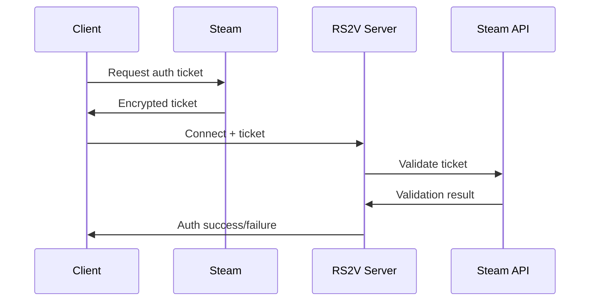

# SECURITY.md — Security Architecture & Best Practices

This document outlines the **security architecture**, **threat model**, **implementation details**, and **best practices** for the RS2V Custom Server.  
For deployment security hardening, see **DEPLOYMENT.md**. For API security details, see **API.md**.

## 1 · Security Overview

The RS2V server implements **defense-in-depth** security with multiple layers of protection against common attack vectors in game servers.

| Security Layer | Primary Defense | Implementation |
|----------------|-----------------|----------------|
| **Network** | DDoS, packet flooding, protocol attacks | Rate limiting, validation, firewalls |
| **Authentication** | Unauthorized access, session hijacking | Steam integration, secure tokens |
| **Anti-Cheat** | Game manipulation, exploits | EAC integration, behavioral analysis |
| **Input Validation** | Injection, buffer overflow, malformed data | Strict parsing, sanitization |
| **Access Control** | Privilege escalation, unauthorized commands | RBAC, command authorization |
| **Data Protection** | Information disclosure, tampering | Encryption, integrity checks |

## 2 · Threat Model

### 2.1 Threat Actors

| Actor | Motivation | Capability | Primary Targets |
|-------|------------|------------|-----------------|
| **Script Kiddies** | Disruption, attention | Low | DDoS, basic exploits |
| **Cheaters** | Unfair advantage | Medium | Game state, movement, aimbots |
| **Griefers** | Harassment, trolling | Low-Medium | Chat, team killing, disruption |
| **Cybercriminals** | Financial gain, data theft | High | Server infrastructure, user data |
| **Advanced Persistent Threats** | Espionage, long-term access | Very High | Complete system compromise |

### 2.2 Attack Vectors

| Vector | Risk Level | Mitigation |
|--------|------------|------------|
| **Network flooding** | High | Rate limiting, DDoS protection |
| **Packet manipulation** | High | Cryptographic validation |
| **Authentication bypass** | Critical | Multi-factor verification |
| **Code injection** | Critical | Input sanitization, sandboxing |
| **Memory corruption** | High | ASLR, stack protection, safe languages |
| **Social engineering** | Medium | Staff training, verification procedures |

### 2.3 Assets and Impact

| Asset | Confidentiality Impact | Integrity Impact | Availability Impact |
|-------|----------------------|------------------|-------------------|
| **Player credentials** | High | High | Medium |
| **Game state** | Low | High | High |
| **Server infrastructure** | Medium | High | Critical |
| **Admin access** | High | Critical | Critical |
| **Telemetry data** | Medium | Low | Low |

## 3 · Authentication & Authorization

### 3.1 Steam Authentication Integration

**Header:** `Server/Security/SteamAuth.h`

```cpp
namespace Security {

class SteamAuth {
public:
    struct AuthResult {
        enum Status { Success, Invalid, Expired, Banned, RateLimit } status;
        uint64_t steamId;
        std::string displayName;
        std::chrono::system_clock::time_point validUntil;
    };

    bool Initialize(const std::string& apiKey);
    AuthResult ValidateTicket(const std::vector& ticket, 
                             const std::string& clientIP);
    bool RevokeSession(uint64_t steamId);
    
private:
    std::string m_apiKey;
    std::unordered_map m_activeSessions;
    mutable std::shared_mutex m_sessionMutex;
};

}
```

#### 3.1.1 Authentication Flow



#### 3.1.2 Session Management

| Property | Value | Rationale |
|----------|-------|-----------|
| **Session lifetime** | 24 hours | Balance between security and convenience |
| **Ticket validation** | Real-time | Prevent replay attacks |
| **Session storage** | In-memory only | No persistent session state |
| **Concurrent sessions** | 1 per Steam ID | Prevent account sharing |

### 3.2 Role-Based Access Control (RBAC)

```cpp
namespace Security {

enum class Permission : uint32_t {
    None            = 0,
    Connect         = 1  m_pendingChallenges;
};
```

## 4 · Anti-Cheat System

### 4.1 Easy Anti-Cheat (EAC) Integration

**Header:** `Server/Security/EACProxy.h`

```cpp
namespace Security {

class EACProxy {
public:
    enum class ViolationType {
        None,
        MemoryManipulation,
        ProcessManipulation,
        NetworkManipulation,
        TimeManipulation,
        Unknown
    };
    
    struct ViolationEvent {
        uint32_t clientId;
        ViolationType type;
        std::string description;
        std::chrono::system_clock::time_point timestamp;
        std::vector evidence;
    };

    bool Initialize(const std::string& productId, 
                   const std::string& productVersion);
    void Shutdown();
    
    bool RegisterClient(uint32_t clientId, const ClientInfo& info);
    void UnregisterClient(uint32_t clientId);
    
    ValidationResult ProcessClientMessage(uint32_t clientId, 
                                        const std::vector& data);
    
    void SetViolationHandler(std::function handler);
    
private:
    void* m_eacHandle;
    std::function m_violationHandler;
};

}
```

#### 4.1.1 EAC Configuration

```ini
# configs/eac.ini
[EAC]
ProductId=your_eac_product_id
ProductVersion=1.0.0
KickOnViolation=true
BanOnRepeatedViolation=true
ViolationThreshold=3
BanDurationHours=24

[Scanning]
EnableMemoryScanning=true
EnableProcessScanning=true
EnableNetworkScanning=false
ScanInterval=30000

[Reporting]
SendTelemetryData=false
LogViolations=true
ViolationLogFile=logs/eac_violations.log
```

### 4.2 Behavioral Analysis

```cpp
namespace Security {

class BehaviorAnalyzer {
public:
    struct PlayerProfile {
        // Movement statistics
        float avgSpeed;
        float maxSpeed;
        uint32_t impossibleMovements;
        
        // Aim statistics
        float headShotRatio;
        float reactionTime;
        uint32_t snapAims;
        
        // Pattern detection
        uint32_t suspiciousPatterns;
        std::chrono::steady_clock::time_point lastAnalysis;
    };
    
    void AnalyzeMovement(uint32_t playerId, const MovementData& data);
    void AnalyzeCombat(uint32_t playerId, const CombatData& data);
    void AnalyzeInput(uint32_t playerId, const InputData& data);
    
    float GetSuspicionScore(uint32_t playerId) const;
    PlayerProfile GetProfile(uint32_t playerId) const;
    
private:
    std::unordered_map m_profiles;
    std::shared_mutex m_profileMutex;
};

}
```

### 4.3 Movement Validation

```cpp
namespace Security {

class MovementValidator {
public:
    struct MovementLimits {
        float maxSpeed = 600.0f;           // units/second
        float maxAcceleration = 1200.0f;   // units/second²
        float maxJumpHeight = 100.0f;      // units
        float maxTeleportDistance = 50.0f; // units (lag compensation)
    };
    
    enum class ValidationResult {
        Valid,
        SpeedHack,
        TeleportHack,
        FlyHack,
        NoClipHack
    };
    
    ValidationResult ValidateMovement(uint32_t playerId, 
                                    const MovementCommand& cmd,
                                    float deltaTime);
    
    void SetLimits(const MovementLimits& limits);
    MovementLimits GetLimits() const;
    
private:
    MovementLimits m_limits;
    std::unordered_map m_lastPositions;
    std::unordered_map m_lastUpdates;
};

}
```

## 5 · Network Security

### 5.1 Packet Validation

```cpp
namespace Network {

class PacketValidator {
public:
    enum class ValidationResult {
        Valid,
        InvalidFormat,
        InvalidChecksum,
        InvalidSequence,
        Oversized,
        RateLimited,
        Banned
    };
    
    ValidationResult ValidatePacket(const RawPacket& packet, 
                                  const ClientEndpoint& sender);
    
    void SetRateLimit(PacketType type, uint32_t maxPerSecond);
    void BanEndpoint(const std::string& ip, std::chrono::minutes duration);
    
private:
    std::unordered_map m_rateLimiters;
    std::unordered_map m_bannedEndpoints;
    mutable std::shared_mutex m_banMutex;
};

}
```

### 5.2 DDoS Protection

```cpp
namespace Security {

class DDoSProtection {
public:
    struct ProtectionConfig {
        uint32_t maxPacketsPerSecond = 100;
        uint32_t maxBytesPerSecond = 100000;
        uint32_t maxConnectionsPerIP = 3;
        std::chrono::seconds banDuration{300};
    };
    
    bool ShouldAcceptPacket(const std::string& sourceIP, 
                           size_t packetSize);
    
    void SetConfig(const ProtectionConfig& config);
    std::vector GetBannedIPs() const;
    
private:
    ProtectionConfig m_config;
    std::unordered_map m_clientLimits;
    std::unordered_set m_bannedIPs;
    mutable std::shared_mutex m_limitMutex;
};

}
```

### 5.3 Encryption and Integrity

```cpp
namespace Security {

class CryptoManager {
public:
    bool Initialize();
    
    // Packet encryption (optional for sensitive data)
    std::vector EncryptPacket(const std::vector& data,
                                      const std::string& clientKey);
    std::vector DecryptPacket(const std::vector& encrypted,
                                      const std::string& clientKey);
    
    // Integrity protection (always enabled)
    std::string CalculateHMAC(const std::vector& data,
                             const std::string& key);
    bool VerifyHMAC(const std::vector& data,
                   const std::string& hmac,
                   const std::string& key);
    
    // Key management
    std::string GenerateSessionKey();
    void InvalidateSessionKey(const std::string& key);
    
private:
    std::random_device m_rng;
    std::mt19937 m_prng;
};

}
```

## 6 · Input Validation & Sanitization

### 6.1 Command Validation

```cpp
namespace Security {

class InputValidator {
public:
    // Chat message sanitization
    std::string SanitizeChatMessage(const std::string& message);
    
    // Player name validation
    bool IsValidPlayerName(const std::string& name);
    
    // Command validation
    bool IsValidCommand(const std::string& command, 
                       const std::vector& args);
    
    // Generic string validation
    bool ContainsMaliciousContent(const std::string& input);
    
private:
    std::vector m_bannedPatterns;
    std::unordered_set m_bannedWords;
    size_t m_maxMessageLength = 256;
    size_t m_maxNameLength = 32;
};

}
```

### 6.2 Script Sandbox Security

```cpp
namespace Scripting {

class SecuritySandbox {
public:
    struct SandboxConfig {
        std::chrono::milliseconds maxExecutionTime{500};
        size_t maxMemoryBytes = 64 * 1024 * 1024; // 64 MB
        std::vector allowedAssemblies;
        std::vector blockedNamespaces;
        bool allowFileAccess = false;
        bool allowNetworkAccess = false;
    };
    
    bool ExecuteScript(const std::string& scriptCode,
                      const std::string& entryPoint,
                      const std::vector& args,
                      ScriptResult& result);
    
    void SetConfig(const SandboxConfig& config);
    std::vector GetViolations() const;
    
private:
    SandboxConfig m_config;
    std::vector m_violations;
    std::mutex m_violationMutex;
};

}
```

## 7 · Ban Management

### 7.1 Ban System Architecture

```cpp
namespace Security {

class BanManager {
public:
    enum class BanType {
        Temporary,
        Permanent,
        Conditional  // Lifted when condition met
    };
    
    enum class BanScope {
        SteamID,
        IPAddress,
        HardwareID,
        Subnet
    };
    
    struct BanEntry {
        std::string identifier;
        BanScope scope;
        BanType type;
        std::chrono::system_clock::time_point createdAt;
        std::chrono::system_clock::time_point expiresAt;
        std::string reason;
        std::string adminSteamId;
        bool active;
    };
    
    bool AddBan(const BanEntry& ban);
    bool RemoveBan(const std::string& identifier, BanScope scope);
    bool IsBanned(const std::string& identifier, BanScope scope) const;
    
    std::vector GetActiveBans() const;
    std::vector GetBanHistory(const std::string& identifier) const;
    
    void LoadBansFromFile(const std::string& filename);
    void SaveBansToFile(const std::string& filename) const;
    
private:
    std::vector m_bans;
    mutable std::shared_mutex m_banMutex;
};

}
```

### 7.2 Hardware Fingerprinting

```cpp
namespace Security {

class HardwareFingerprint {
public:
    struct SystemInfo {
        std::string cpuId;
        std::string motherboardId;
        std::string diskId;
        std::string macAddress;
        std::string windowsId;  // Windows only
    };
    
    static SystemInfo CollectSystemInfo();
    static std::string GenerateFingerprint(const SystemInfo& info);
    static bool ValidateFingerprint(const std::string& fingerprint,
                                   const SystemInfo& info);
    
private:
    static std::string HashData(const std::string& data);
};

}
```

## 8 · Security Monitoring & Incident Response

### 8.1 Security Event Logging

```cpp
namespace Security {

enum class SecurityEventType {
    AuthenticationFailure,
    AuthorizationFailure,
    SuspiciousActivity,
    AntiCheatViolation,
    NetworkAttack,
    ConfigurationChange,
    AdminAction
};

struct SecurityEvent {
    SecurityEventType type;
    std::chrono::system_clock::time_point timestamp;
    std::string sourceIP;
    std::string sourceId;  // Steam ID, client ID, etc.
    std::string description;
    std::unordered_map metadata;
    uint32_t severity;  // 1-10
};

class SecurityLogger {
public:
    void LogEvent(const SecurityEvent& event);
    void LogAuthentication(const std::string& steamId, 
                          const std::string& ip, 
                          bool success);
    void LogAntiCheatViolation(uint32_t clientId, 
                              const std::string& violation);
    void LogSuspiciousActivity(const std::string& activity,
                              const std::string& source);
    
    std::vector GetRecentEvents(
        std::chrono::minutes window = std::chrono::minutes{60}) const;
    
private:
    mutable std::mutex m_eventMutex;
    std::deque m_events;
    size_t m_maxEvents = 10000;
};

}
```

### 8.2 Automated Response System

```cpp
namespace Security {

class AutoResponse {
public:
    struct ResponseRule {
        SecurityEventType triggerType;
        uint32_t threshold;
        std::chrono::minutes timeWindow;
        std::function&)> action;
        std::chrono::minutes cooldown;
    };
    
    void AddRule(const ResponseRule& rule);
    void ProcessEvent(const SecurityEvent& event);
    void SetResponseHandler(SecurityEventType type, 
                           std::function handler);
    
private:
    std::vector m_rules;
    std::unordered_map> m_recentEvents;
    std::mutex m_responseMutex;
};

}
```

## 9 · Security Configuration

### 9.1 Security Policy Configuration

```ini
# configs/security.ini
[Authentication]
RequireSteamAuth=true
SessionTimeoutMinutes=1440
MaxLoginAttempts=3
LoginBanDurationMinutes=30

[Authorization]
EnableRBAC=true
DefaultPermissions=Connect,Chat,Vote
ModeratorAutoPromote=false
AdminRequireChallenge=true

[AntiCheat]
EnableEAC=true
EnableBehaviorAnalysis=true
MovementValidation=true
SpeedHackThreshold=650.0
TeleportThreshold=75.0
SuspicionScoreLimit=8.5

[Network]
EnableDDoSProtection=true
MaxPacketsPerSecond=100
MaxBytesPerSecond=100000
MaxConnectionsPerIP=3
RateLimitBanDuration=300

[Bans]
BanListFile=banlist.txt
AutoSaveBans=true
MaxBanHistoryPerUser=10
HardwareFingerprintBans=true

[Logging]
SecurityLogFile=logs/security.log
LogLevel=INFO
RotateDaily=true
MaxLogSize=100MB
```

### 9.2 Vulnerability Management

| Category | Check Frequency | Automated Response |
|----------|-----------------|-------------------|
| **Dependency vulnerabilities** | Weekly | Alert + upgrade recommendation |
| **Configuration drift** | Daily | Auto-correction where possible |
| **Certificate expiration** | Daily | Alert 30 days before expiry |
| **Unusual traffic patterns** | Real-time | Rate limiting, temporary bans |
| **Failed authentication spikes** | Real-time | IP blocking, alerting |

## 10 · Security Testing

### 10.1 Security Test Suite

```cpp
// tests/SecurityTests.cpp (excerpt)

TEST(SecurityTests, AuthenticationBypass) {
    // Test for authentication bypass vulnerabilities
    AuthManager auth;
    EXPECT_FALSE(auth.Authenticate("", ""));
    EXPECT_FALSE(auth.Authenticate("invalid", ""));
    EXPECT_FALSE(auth.AuthenticateAdmin("", ""));
}

TEST(SecurityTests, InputValidation) {
    InputValidator validator;
    EXPECT_FALSE(validator.IsValidPlayerName("../../../etc/passwd"));
    EXPECT_FALSE(validator.IsValidPlayerName("alert('xss')"));
    EXPECT_TRUE(validator.IsValidPlayerName("ValidPlayerName"));
}

TEST(SecurityTests, MovementValidation) {
    MovementValidator validator;
    MovementCommand normalMove{Vector3{0,0,0}, Vector3{10,0,0}, 0.1f};
    MovementCommand speedHack{Vector3{0,0,0}, Vector3{1000,0,0}, 0.1f};
    
    EXPECT_EQ(validator.ValidateMovement(1, normalMove, 0.1f), 
              ValidationResult::Valid);
    EXPECT_EQ(validator.ValidateMovement(1, speedHack, 0.1f), 
              ValidationResult::SpeedHack);
}

TEST(SecurityTests, PacketFloodProtection) {
    DDoSProtection protection;
    for (int i = 0; i  100) EXPECT_FALSE(accept);  // Should be rate limited
    }
}
```

### 10.2 Penetration Testing Guidelines

| Test Type | Frequency | Scope |
|-----------|-----------|-------|
| **Network penetration** | Quarterly | All exposed services |
| **Application security** | Before major releases | Game protocol, admin interfaces |
| **Social engineering** | Annually | Staff, community leaders |
| **Physical security** | Annually | Server hosting facilities |

## 11 · Incident Response

### 11.1 Security Incident Classification

| Severity | Definition | Response Time | Escalation |
|----------|------------|---------------|------------|
| **Critical** | Active attack, data breach | 15 minutes | Immediate |
| **High** | Privilege escalation, DoS | 1 hour | 2 hours |
| **Medium** | Cheat detection, policy violation | 4 hours | 24 hours |
| **Low** | Suspicious activity, minor violation | 24 hours | 7 days |

### 11.2 Response Procedures

#### 11.2.1 Active Attack Response

```bash
#!/bin/bash
# scripts/incident-response.sh

# Immediate containment
sudo iptables -I INPUT -s $ATTACKER_IP -j DROP
sudo systemctl stop rs2v-server

# Evidence collection
sudo cp -r /opt/rs2v/logs /incident/evidence/
sudo netstat -tulpn > /incident/evidence/network-state.txt
sudo ps aux > /incident/evidence/process-list.txt

# Notification
curl -X POST "$DISCORD_WEBHOOK" \
  -H "Content-Type: application/json" \
  -d '{"content": "🚨 SECURITY INCIDENT: Active attack detected and contained"}'

# Recovery
sudo systemctl start rs2v-server
```

#### 11.2.2 Data Breach Response

1. **Immediate containment** (0-15 minutes)
   - Isolate affected systems
   - Preserve forensic evidence
   - Document initial findings

2. **Assessment** (15 minutes-1 hour)
   - Determine scope of breach
   - Identify compromised data
   - Assess ongoing threats

3. **Notification** (1-6 hours)
   - Internal stakeholders
   - Affected users (if applicable)
   - Regulatory authorities (if required)

4. **Recovery** (6-72 hours)
   - Patch vulnerabilities
   - Restore from clean backups
   - Implement additional controls

## 12 · Compliance and Governance

### 12.1 Security Policies

| Policy Area | Implementation | Review Frequency |
|-------------|----------------|------------------|
| **Access Control** | RBAC system, MFA for admins | Quarterly |
| **Data Protection** | Encryption, minimal collection | Semi-annually |
| **Incident Response** | Documented procedures, testing | Annually |
| **Vulnerability Management** | Automated scanning, patching | Monthly |
| **Security Awareness** | Training, documentation | Annually |

### 12.2 Security Metrics

| Metric | Target | Measurement |
|--------|--------|-------------|
| **Mean Time to Detection (MTTD)** |  80% | Automated testing |
| **Vulnerability patch time** | < 48 hours | Vulnerability management |
| **Security training completion** | 100% staff | Training records |

This comprehensive security guide provides the foundation for maintaining a secure RS2V server environment. Regular reviews and updates of these security measures ensure ongoing protection against evolving threats.

**End of SECURITY.md**  
For security concerns or questions, please contact the security team or create a confidential issue with the **security** label.